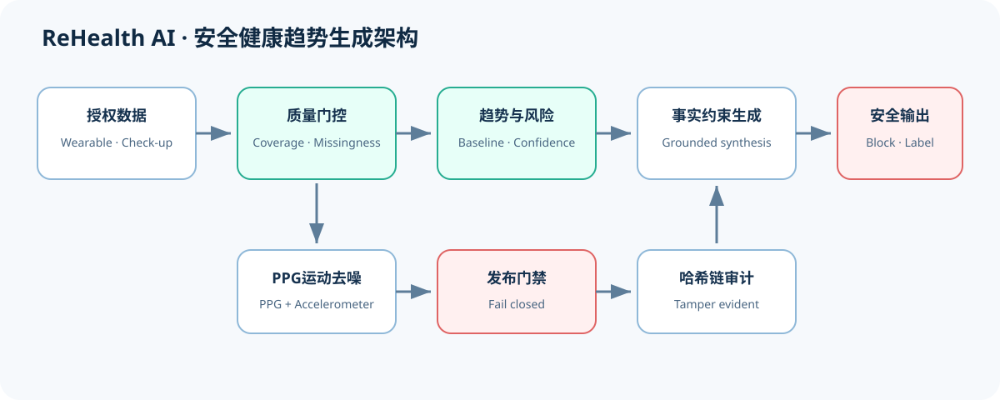
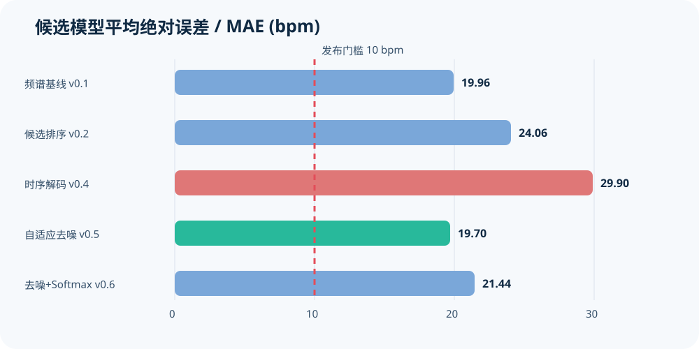
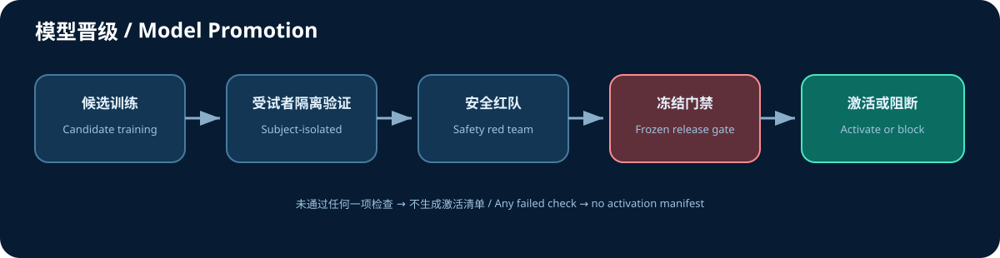

<p align="center"></p>

<p align="center"><strong>面向可穿戴设备与体检数据的安全健康趋势报告生成合成算法</strong><br/>
<a href="README_EN.md">English</a> · <a href="docs/algorithm-design.md">算法设计</a> · <a href="docs/benchmark-results.md">真实数据评测</a></p>

<p align="center">
  <a href="https://github.com/csong8904-spec/rehealth-ai-algorithm/actions/workflows/ci.yml"></a>
  <a href="LICENSE"></a>
  
</p>

> [!WARNING]
> 本项目是研究及工程参考实现，不是医疗器械，不提供疾病诊断、治疗、处方或急救判断。
> 当前真实PPG模型未通过生产发布门槛，禁止直接用于真实用户健康结论。

## 项目简介

**ReHealth AI健康趋势报告生成合成算法**将用户授权的可穿戴设备或体检指标转换为带证据、
置信度和人工智能标识的健康趋势报告。系统采用失败关闭设计：数据质量不足、模型未通过
评测或生成内容越界时，自动拒绝输出风险结论。

<p align="center"></p>

## 核心能力

- 数据质量检查、缺失值识别和个人基线比较；
- 腕部PPG与三轴加速度融合及运动伪影抑制；
- 按受试者隔离的训练与验证，避免用户级数据泄漏；
- 结构化风险预测与事实约束报告生成；
- 疾病诊断、处方、疗效保证等医疗越界拦截；
- AI生成内容显式标识、API机器标识及哈希链审计；
- 准确性、P90误差、覆盖率和样本规模发布门禁；
- 可选本地大模型适配器与QLoRA训练配置。

## 验证结果

公开的 PhysioNet 腕部PPG运动数据用于离线工程验证，ECG标注只作为评测标签，不参与推理。

<p align="center"></p>

| 候选版本 | MAE ↓ | P90误差 ↓ | ±10 bpm占比 ↑ | 结论 |
|---|---:|---:|---:|---|
| 频谱基线 v0.1 | 19.96 | 48.51 | 47.37% | 阻断 |
| 候选排序 v0.2 | 24.06 | 69.28 | 61.11% | 阻断 |
| 时序解码 v0.4 | 29.90 | 74.07 | 55.56% | 拒绝 |
| 自适应去噪 v0.5 | **19.70** | 56.06 | **66.67%** | 研究领先，仍阻断 |
| 去噪+Softmax v0.6 | 21.44 | 56.53 | 55.56% | 拒绝 |

当前冻结门槛为 MAE≤10 bpm、P90≤15 bpm、±10 bpm占比≥90%、有效覆盖率≥50%，并要求
不少于20名受试者和100条记录。现有公开数据仅8名受试者、18条可评测记录，所有候选均未
获准生产部署。完整分析见[真实数据评测](docs/benchmark-results.md)。

## 快速开始

环境要求：Python 3.10+，基础运行仅依赖 NumPy。

```bash
python -m venv .venv
# Windows: .venv\Scripts\activate
# Linux/macOS: source .venv/bin/activate
pip install -e .
python -m unittest discover -s tests -v
```

训练合成工程模型并生成演示报告：

```bash
python -m healthsynth.cli train-synthetic --output artifacts
python -m healthsynth.cli demo --model artifacts/risk_model.json
```

启动本地API（生产环境必须从密钥管理系统注入审计盐值）：

```bash
python -m healthsynth.api --audit-salt "replace-with-a-managed-secret"
```

- 健康检查：`GET /healthz`
- 报告接口：`POST /v1/reports`
- API响应头：`X-AI-Generated: true`

## 复现实验

```bash
python scripts/download_wrist_dataset.py
python scripts/benchmark_wrist_dataset.py
python scripts/train_fusion_ranker.py --adaptive-denoise \
  --model artifacts/models/ppg_motion_ranker_adaptive_denoise_v1.json \
  --report artifacts/benchmarks/ppg_motion_ranker_adaptive_denoise_v1_loso.json
python scripts/evaluate_safety.py
python scripts/evaluate_release_gate.py \
  artifacts/benchmarks/ppg_motion_ranker_adaptive_denoise_v1_loso.json \
  --profile full \
  --decision artifacts/release-decisions/ppg-motion-ranker-adaptive-denoise-v1.json
```

发布门禁返回退出码 `2` 是当前模型被正确阻断的预期结果。

## 工作流程

<p align="center"></p>

## 目录结构

```text
healthsynth/
├── src/healthsynth/       # 推理、信号处理、安全、审计与门禁
├── scripts/               # 数据、训练、评测和交付脚本
├── configs/               # 可选大模型微调配置
├── tests/                 # 自动化测试
├── docs/                  # 算法、模型卡、数据和备案材料
├── artifacts/benchmarks/  # 可复核的公开数据评测结果
└── data/manifests/        # 公开数据来源与校验清单
```

## 大模型说明

风险计算本身不依赖大模型。自然语言报告可以使用内置的确定性生成器，也可以连接经过许可
审查、安全微调和离线评测的本地因果语言模型。仓库中的合成SFT数据只用于验证工程链路，
未经专业人员复核，不得作为医疗效果或备案效果证明。

## 安全与合规

- 只处理获得明确授权的数据；
- 第一版不接收姓名、身份证号、精确地址、人脸、声纹或原始定位轨迹；
- 不记录原始健康数值到普通审计日志；
- 任何生产使用都必须重新完成隐私、内容安全、医疗器械边界和真实数据验证；
- 发现安全问题请阅读 [SECURITY.md](SECURITY.md)，不要在公开Issue中披露个人健康数据。

## 参与贡献

欢迎提交问题、测试、文档和算法改进。提交前请阅读 [CONTRIBUTING.md](CONTRIBUTING.md)。

## 开源许可

代码以 [Apache License 2.0](LICENSE) 发布。数据集、基础模型和第三方依赖分别遵循其自身
许可证；本许可证不授予医疗用途批准、数据权利或第三方模型权利。
