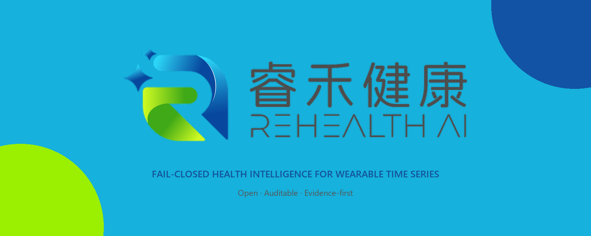

<p align="center"></p>

# ReHealth AI 中文说明

[English main page](README.md) · [算法设计](docs/algorithm-design.md) · [完整评测](docs/benchmark-results.md)

ReHealth AI 是一个面向可穿戴设备和体检数据的安全健康趋势报告生成合成算法。它不是简单
的大模型封装，而是把信号估计、结构化风险计算、事实约束生成、安全检查和审计拆成可独立
验证的边界；任何边界不合格，系统都会拒绝继续输出。

> 本项目是研究及工程参考实现，不是医疗器械，不提供疾病诊断、治疗、处方或急救判断。
> 当前PPG研究模型未通过生产门禁，禁止直接用于真实用户健康结论。

## 四项核心创新

1. **加速度参考的PPG去噪**：在每个推理窗口内估计运动相关分量，去噪过程不读取ECG标签；
2. **事实防火墙**：报告模型只能读取经过校验的结构化事实，不能直接接触原始健康记录；
3. **失败关闭发布门禁**：平均误差、P90、覆盖率和样本规模任一不合格都不会生成激活清单；
4. **防篡改推理审计**：以不包含原始健康数值的摘要建立哈希链，检测日志静默修改。

## 快速运行

```bash
git clone https://github.com/csong8904-spec/rehealth-ai-algorithm.git
cd rehealth-ai-algorithm
python -m venv .venv
# Windows: .venv\Scripts\activate
pip install -e .
python -m unittest discover -s tests -v
python -m healthsynth.cli demo --model artifacts/risk_model.json
```

## 当前真实评测

| 候选模型 | MAE | P90 | 误差≤10 bpm占比 | 状态 |
|---|---:|---:|---:|---|
| 频谱基线 | 19.96 | 48.51 | 47.37% | 阻断 |
| 候选排序 | 24.06 | 69.28 | 61.11% | 阻断 |
| 时序解码 | 29.90 | 74.07 | 55.56% | 拒绝 |
| 自适应去噪 | **19.70** | 56.06 | **66.67%** | 研究领先，仍阻断 |
| 去噪+Softmax | 21.44 | 56.53 | 55.56% | 拒绝 |

项目公开全部结果，包括效果回退的实验，不以单个最佳样本代替整体性能。完整限制、数据来源、
模型卡和备案材料均位于 [`docs/`](docs/)；贡献前请阅读 [CONTRIBUTING.md](CONTRIBUTING.md)，
安全问题请按 [SECURITY.md](SECURITY.md) 私密报告。

代码采用 [Apache-2.0](LICENSE) 许可，数据集和基础模型遵循各自许可证。该开源许可不授予
“睿禾健康 / ReHealth AI”名称、官方 Logo 等品牌资产的商标使用权，也不得暗示官方背书；
详见[品牌资产说明](docs/brand/README.md)。
